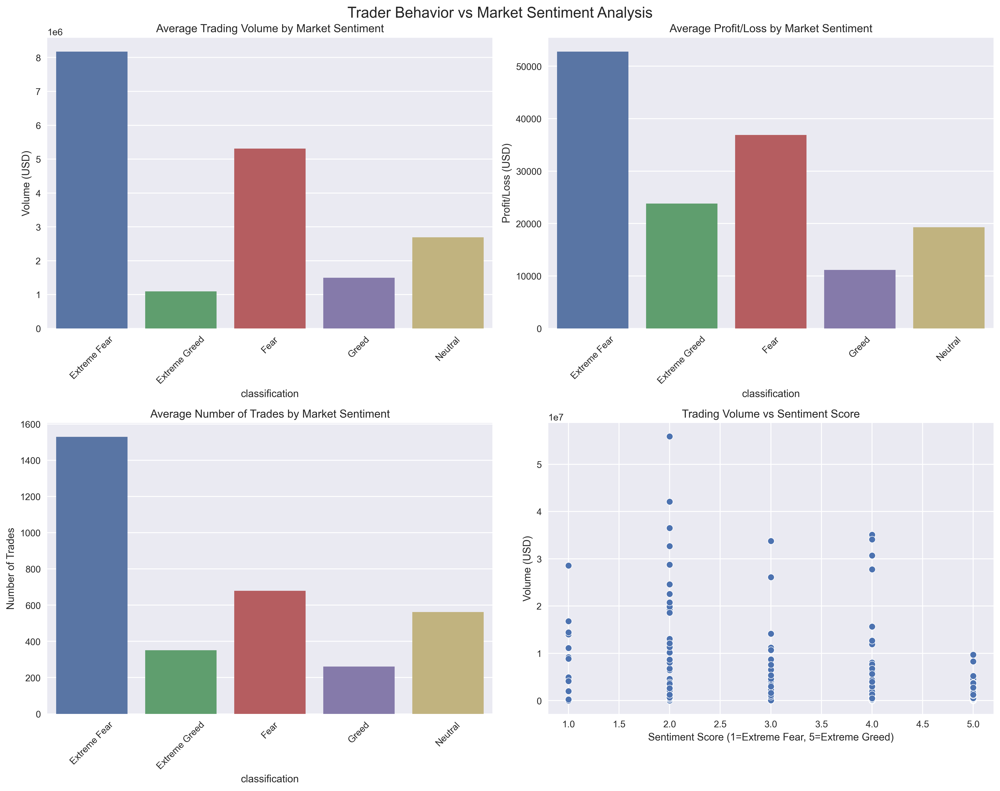
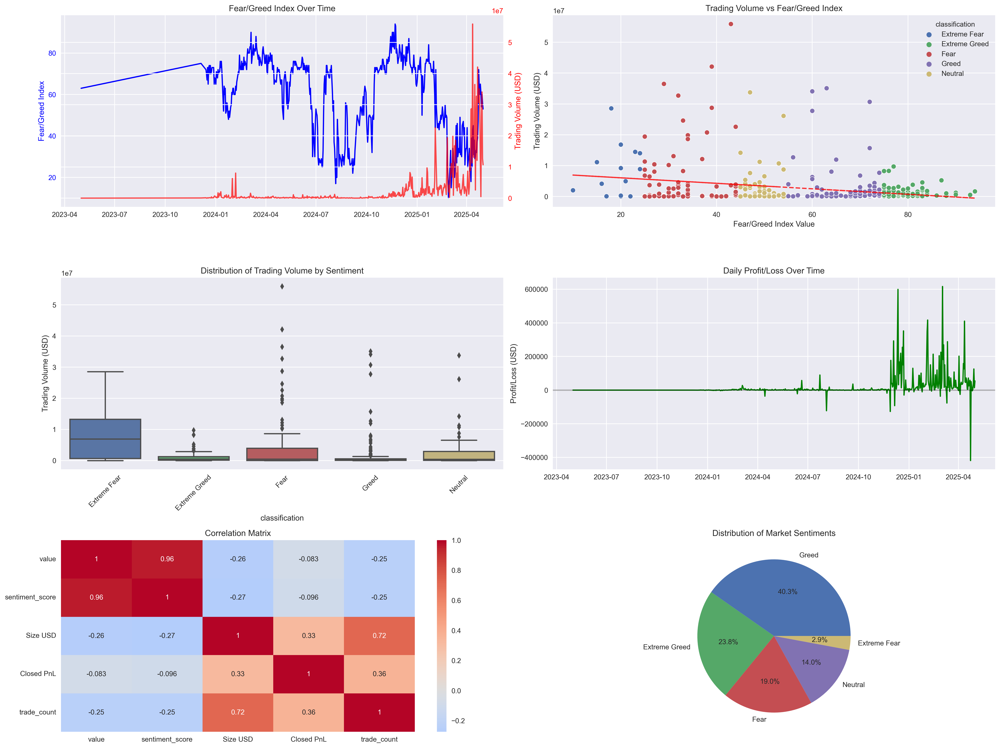

# Data Science Assignment: Trader Behavior vs Market Sentiment Analysis

This repository contains a comprehensive analysis of the relationship between trader behavior on Hyperliquid and Bitcoin market sentiment.

## Files in this Repository

### Data Files
- [`fear_greed_index.csv`](https://drive.google.com/file/d/1ONNBD-4qx-o1A194GvTIs7ns4_nWNCFz/view?usp=drive_link) - Bitcoin market sentiment data (Fear & Greed Index)
- [`historical_data.csv`](https://drive.google.com/file/d/1UQ_zrRXz42Kkst-QIbOlTj4-lWrhZQti/view?usp=drive_link) - Hyperliquid trader transaction data

### Analysis Scripts
- [`analysis.py`](https://drive.google.com/file/d/1E1OEFG0mbbHod98qQydHIFBHGsSBpeRZ/view?usp=drive_link) - Main analysis script that produces basic insights and visualizations
- [`advanced_analysis.py`](https://drive.google.com/file/d/1dJ5PxDSDYHQ0bYVAI_6b280W3CtFt9_A/view?usp=drive_link) - Advanced analysis script with additional metrics and visualizations

### Reports
- [`trader_behavior_analysis_report.md`](https://drive.google.com/file/d/1q0GinucWnUS4gYwpf0aSBpvRAzSboIQ_/view?usp=drive_link) - Initial findings and insights report
- [`final_analysis_report.md`](https://drive.google.com/file/d/1v9yIKuqcqRAHXSVEj2_5tTtkpJqJn9yK/view?usp=drive_link) - Comprehensive report with all findings and strategic implications

### Visualizations
-  - Basic visualization output from analysis.py
-  - Advanced visualization output from advanced_analysis.py

## Key Findings

Our analysis reveals several counterintuitive patterns:

1. **Trading activity is highest during fearful market periods** and lowest during greedy periods
2. **Profitability follows a similar pattern**, with traders making more money on average during fearful periods
3. **Market sentiment and trader behavior are inversely correlated**:
   - Sentiment vs Volume: -0.274
   - Sentiment vs Trade Count: -0.247
   - Sentiment vs Profitability: -0.096
  
## Directory
ds_candidate/
   ├── notebook_1.ipynb               # Main analysis notebook
   ├── notebook_2.ipynb               # Advanced analysis notebook
   ├── csv_files/                     # Raw data files
      │   ├── fear_greed_index.csv       # Bitcoin market sentiment data
      │   └── historical_data.csv        # Hyperliquid trader data
      ├── outputs/                       # Visualization outputs
      │   ├── trader_behavior_analysis.png
      │   └── advanced_trader_behavior_analysis.png
      ├── ds_report.pdf                  # Final report
      └── README.md                      # This file

## How to Run the Analysis

1. Ensure you have Python installed with the required packages:
   ```
   pip install pandas numpy matplotlib seaborn
   ```

2. Run the main analysis:
   ```
   python analysis.py
   ```

3. Run the advanced analysis:
   ```
   python advanced_analysis.py
   ```

## Strategic Implications

The findings suggest that successful traders may be following contrarian strategies, taking advantage of market inefficiencies that arise during periods of fear and uncertainty. This "be fearful when others are greedy" approach appears to be reflected in actual trading behavior on Hyperliquid.

## Data Overview

- **Analysis Period**: 479 days (May 1, 2023 to May 1, 2025)
- **Total Trading Volume**: $1.19 billion
- **Overall Profit/Loss**: $10.25 million gain

- **Total Number of Trades**: 211,218


